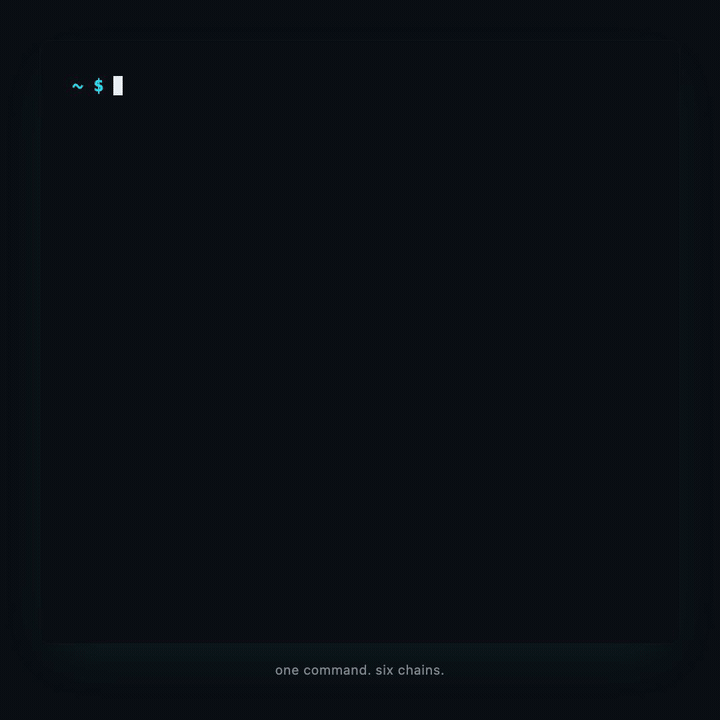

# glnc



```sh
brew install aryarahimi1/glnc/glnc
```

Etherscan in your terminal — no browser, no account, no API key.

```
glnc balance vitalik.eth
glnc balance 0xd8dA... 0xABC... bc1q...   ← multi-wallet portfolio
glnc balance 0xd8dA... --watch            ← live deltas every 15s
glnc tx 0x5c504e... --chain eth
glnc gas                                  ← live gas across 9 chains
```

---

## Features

| | |
|---|---|
| **Zero tracking** | All RPCs are free public endpoints. No account, no API key, nothing phoned home |
| **Multi-RPC quorum (v1.2)** | Every EVM chain ships 2–3 hardcoded public RPCs. Default is sequential fallback; `--rpc-quorum=majority`/`all` fans out in parallel, picks the plurality, and records disagreements in the envelope |
| **Source attribution (v1.2)** | The envelope records which RPC URL answered for each chain (`meta.sources.rpc.providers`) and the block/slot it answered at, so two consecutive runs can be replayed and compared |
| **Token auto-discovery** | Scans ~1,400 tokens per chain via the Uniswap token list — not just USDC/USDT |
| **ENS resolution** | `vitalik.eth` just works. Reverse lookup annotates addresses too |
| **Multi-wallet** | Pass multiple addresses; get per-wallet tables + portfolio grand total |
| **Watch mode** | Re-polls on an interval, shows `+0.5 ETH` / `−100 USDC` deltas in place. Uses the terminal's alternate screen so your scrollback is preserved |
| **Transaction decoder** | Decodes calldata (Uniswap V2/V3, ERC-20, WETH, Governor/Timelock, Safe, MultiSend) + token movements from receipt logs |
| **DeFi positions** | Aave V3 health factor, Uniswap V3 LP NFTs — via `--positions` |
| **NFT holdings** | Top NFT collections per chain via Reservoir — via `--nfts` |
| **Gas tracker** | Live gas across 9 chains (`gas --watch`) — EVM fee tiers + BTC mempool + Solana priority fees |
| **History export** | `glnc history <addr>` → CSV (tax export) or JSON via Etherscan V2 |
| **Conditional alerts** | `glnc alert <addr> --on "balance.eth < 300" --webhook <url>` |
| **Interactive REPL** | `glnc interactive` — paste addresses, jump between commands |
| **Hardened webhook** | SSRF-validated URLs, scheme allowlist, RFC1918/IMDS/loopback blocked |
| **JSON + NDJSON** | Stable, versioned envelopes on stdout — `--json` for one-shot, NDJSON for `--watch` |
| **9 chains for balance · 8 for tx · 9 for gas** | See the [Chain support matrix](#chain-support-matrix) |

---

## What's new in v1.2.0 — "Honest multi-RPC"

A single RPC endpoint is one vendor's view of the chain. Until v1.2.0 glnc
presented that view as truth — if `publicnode` was wrong (stale, censoring,
mis-synced, or returning a 0 balance because they rate-limited you anonymously),
glnc was wrong with it. v1.2.0 stops doing that:

- Every EVM chain now ships **2–3 hardcoded public RPC URLs** in a `RPC_URLS[]`
  array per adapter. Default mode (`--rpc-quorum=any`) is **sequential
  fallback** — try them in order, return the first success — so free-tier
  endpoints don't get triple-loaded for every casual query.
- `--rpc-quorum=majority` queries all providers in parallel, picks the
  plurality, and records the dissenters in `meta.sources.rpc.disagreements[]`.
- `--rpc-quorum=all` requires unanimous agreement and errors on any
  disagreement (combine with `--strict` to exit 3).
- Every balance/tx envelope now carries `meta.sources.rpc.providers` (which
  redacted URL answered for each chain) and a per-chain `blockNumber` (EVM) or
  `slot` (Solana) so consumers can attribute every number to a specific
  vendor + chain position.
- A new `tx --raw` flag returns the upstream RPC response verbatim under
  schema `glnc.tx-raw/v1` — no glnc-level reshaping, so what you see is what
  the provider actually said.
- **Quorum degradation is surfaced, not hidden.** When `--rpc-quorum=majority`
  or `all` is requested but fewer providers responded than the policy needs
  (e.g. 1-of-3), the chain is listed in `meta.sources.rpc.degraded[]`,
  `meta.partial` flips to `true`, and an interactive TTY sees a one-line
  stderr warning. You asked for quorum; you find out when you didn't get it.
- **The RPC list was re-curated against live availability before tag.** Ankr
  was removed (now requires API keys), `*.llamarpc.com` was removed (dead DNS
  or broken TLS on every chain), `polygon-rpc.com` was removed (auth-only),
  plus several dead Solana endpoints. Replacements: drpc.org, eth.merkle.io,
  1rpc.io/matic, solana.lava.build. Solana ships 2 URLs (the free-public
  landscape is sparse); linea ships 3.
- **Bad flag combinations fail loudly at parse time.** `glnc balance --raw`,
  `glnc gas --rpc-quorum=majority`, `glnc history --rpc-quorum=all`, etc.
  return `Error: --raw is only supported on the 'tx' command` (or the
  equivalent for `--rpc-quorum`) and exit 1 instead of silently no-op'ing.

glnc does not verify on-chain truth; it surfaces vendor disagreement and lets
you decide what to do about it. See [Multi-RPC quorum](#multi-rpc-quorum)
below, or the full [CHANGELOG](CHANGELOG.md).

---

## Installation

### Homebrew (macOS / Linux)

```sh
brew install aryarahimi1/glnc/glnc
```

Adds the official tap and installs a prebuilt binary. No Bun, no Node, no dependencies.

### Install script (curl)

```sh
curl -fsSL https://glnc.dev/install.sh | bash
```

Downloads the binary for your platform, verifies its SHA256 against the release manifest, and installs it to `~/.local/bin` or `/usr/local/bin`.

Paranoid? Inspect first:
```sh
curl -fsSL https://glnc.dev/install.sh -o install.sh && less install.sh && bash install.sh
```

Environment overrides:
- `GLNC_VERSION=v1.2.3` — pin a specific version
- `GLNC_INSTALL_DIR=/custom/path` — override the install location

<details>
<summary><b>Build from source (advanced)</b></summary>

For contributors. Requires Node ≥ 20.10 (or [Bun](https://bun.sh) ≥ 1.0).

```sh
git clone <repo-url>
cd glnc
npm install
node bin/glnc.js --help     # or: bun bin/glnc.js --help
npm link                    # to expose `glnc` globally for development
```

If you just want to run glnc, use Homebrew or the install script — there's no functional difference.
</details>

---

## Commands

```
glnc balance <address>...      wallet balances across detected chains
glnc tx <hash>                 decode a transaction
glnc gas                       current gas across EVM + BTC + SOL
glnc history <address>         export transaction history (CSV / JSON)
glnc alert <address>           monitor a condition, POST to a webhook on edge
glnc interactive               interactive REPL (alias: glnc i)
glnc schema [<id>]             list / print stable schema ids
glnc --help                    short help (per-command: glnc <cmd> --help)
glnc --version                 print version
```

Per-command help is the canonical reference — `glnc balance --help`,
`glnc gas --help`, etc. The top-level `--help` is intentionally short.

---

## Common flags

| Flag | Description |
|---|---|
| `--chain <name>` | Query a single chain instead of auto-detecting |
| `--watch` / `-w` | Re-poll on an interval; show deltas in place |
| `--interval <N>` | Watch interval in seconds (default 15; `alert` defaults to 120, min 30) |
| `--positions` / `-p` | Include DeFi positions (Aave V3, Uniswap V3 LP) |
| `--nfts` / `-n` | Include NFT holdings (Reservoir API, EVM only) |
| `--verbose` / `-v` | Show full addresses |
| `--json` | Emit machine-readable JSON on stdout (NDJSON when combined with `--watch`) |
| `--ndjson` | Force NDJSON even for one-shot commands |
| `--strict` | One-shot: exit **3** on a partial result (see `meta.partial`). Watch: abort on the first fetch *exception* instead of emitting an `error` event (partial polls keep streaming). Default keeps exit code 0 for scripts already in production. |
| `--rpc-quorum <any\|majority\|all>` | `balance` + `tx`: RPC consensus policy. `any` (default) — sequential, return first success. `majority` — parallel, plurality wins, dissent recorded in `meta.sources.rpc.disagreements`. `all` — parallel, unanimous required, throws on disagreement. See [Multi-RPC quorum](#multi-rpc-quorum) |
| `--raw` | `tx` only: emit the upstream RPC `getTransaction` response verbatim under schema `glnc.tx-raw/v1`. Shape is provider-defined and NOT stable across providers or chains. Implies `--json` |
| `--no-color` | Disable ANSI colors. `NO_COLOR` env and `--json`/`--ndjson` also disable colors |

---

## Documentation

Full docs live at **[glnc.dev](https://glnc.dev/)**. Common entry points:

| | |
|---|---|
| Chain notes | [Ethereum: chain-specific usage notes](https://glnc.dev/chains/ethereum/) |
| `tx` command | [Decode a transaction from the terminal](https://glnc.dev/docs/tx/) |
| `history` CSV | [Export transaction history for taxes](https://glnc.dev/docs/taxes/) |
| Comparison | [glnc vs cast (Foundry)](https://glnc.dev/compare/glnc-vs-cast/) |
| Comparison | [glnc vs Etherscan](https://glnc.dev/compare/glnc-vs-etherscan/) |
| Maintainer | [About the maintainer](https://glnc.dev/about/) |

---

## Chain support matrix

`balance` works on **9 chains** — 7 EVM L1/L2s plus Solana and Bitcoin. `tx`
covers the same set except Bitcoin (8 chains). `gas` covers the same EVM set
plus BTC and SOL fee markets (9 chains).

> **Note:** native balances on Linea and zkSync are priced normally, but
> ERC-20 *token* prices are intentionally fail-closed (`noPrice`) on those
> chains until canonical token addresses are independently verified — this
> prevents spoofed tokens from inheriting real prices. Pass `--show-unpriced`
> to see all balances.

| Chain | `balance` | `tx` | `gas` | Aliases |
|---|---|---|---|---|
| Ethereum | ✓ | ✓ | ✓ | `eth`, `ethereum` |
| Polygon | ✓ | ✓ | ✓ | `poly`, `matic`, `polygon` |
| Arbitrum | ✓ | ✓ | ✓ | `arb`, `arbitrum` |
| Base | ✓ | ✓ | ✓ | `base` |
| Optimism | ✓ | ✓ | ✓ | `op`, `optimism` |
| zkSync | ✓ | ✓ | ✓ | `zk`, `era`, `zksync` |
| Linea | ✓ | ✓ | ✓ | `linea` |
| Solana | ✓ | ✓ | ✓ | `sol`, `solana` |
| Bitcoin | ✓ | — | ✓ | `btc`, `bitcoin` |

---

## Address auto-detection

glnc detects the chain from the address format — no `--chain` needed:

| Pattern | Detected as |
|---|---|
| `0x` + 40 hex | All EVM chains (ethereum, polygon, arbitrum, base, optimism, linea, zksync) |
| `vitalik.eth` or any `.eth` / `.xyz` | ENS → resolved to EVM address |
| `bc1...` (bech32 SegWit) | Bitcoin |
| `1...` or `3...` (legacy) | Bitcoin |
| base58, 32–44 chars | Solana |

---

## Examples

### Balance — EVM address

```
$ glnc balance 0xd8dA6BF26964aF9D7eEd9e03E53415D37aA96045

  ⬢ ETHEREUM  (59 tokens)
  Asset              Amount           USD Value
  ────────────────────────────────────────────
  ETH                    229.579681   $539,891.08
  USDC 0xA0b8…eB48   120,133.627066   $120,106.12
  stETH 0xae7a…fE84        0.00001             —
  ...

  Grand Total: $663,208.68+
  (+ indicates some asset prices are unavailable)
```

### Balance — ENS name

```
$ glnc balance vitalik.eth --chain eth

  Resolved: vitalik.eth → 0xd8dA6BF26964aF9D7eEd9e03E53415D37aA96045

  ⬢ ETHEREUM  (59 tokens)
  ...
```

### Balance — Bitcoin address

```
$ glnc balance bc1qxy2kgdygjrsqtzq2n0yrf2493p83kkfjhx0wlh

  ₿ BITCOIN
  Asset  Amount         USD Value
  ─────────────────────────────────
  BTC         3.654456   $293,292.06

  Grand Total: $293,292.06
```

### Multi-wallet portfolio

```
$ glnc balance vitalik.eth 0xABC...123 bc1q...xyz

  ━━━━━  vitalik.eth (0xd8dA…6045)  ━━━━━━━━━━━━━━━━━━━━━━━━━━━━━━━━
  ⬢ ETHEREUM  (59 tokens)
  ...
  Grand Total: $663,208.68+

  ━━━━━  0xABC…123  ━━━━━━━━━━━━━━━━━━━━━━━━━━━━━━━━━━━━━━━━━━━━━━━━
  ⬢ ETHEREUM  (12 tokens)
  ...

  ━━━━━━━━━━━━━━━━━━━━━━━━━━━━━━━━━━━━━━━━━━━━━━━━━━━━━━━━━━━━━━━━━
  PORTFOLIO TOTAL (3 wallets)                           $968,900.07
```

### Watch mode

```
$ glnc balance 0xd8dA... --watch --interval 30

  ⛓ WATCH MODE  0xd8dA…6045  refreshing every 30s  last: 4.2s  [Ctrl+C to stop]

  ⬢ ETHEREUM  (59 tokens)
  ETH    229.59 (+0.01)   $539,914.40
  USDC   119,900 (-233.6) $119,876.12
  ...
```

Watch mode runs in the terminal's alternate screen buffer (`\x1b[?1049h`), so
on Ctrl+C your scrollback is restored exactly as it was before. Snapshots are
written to `~/.glnc/snapshots.json` on each cycle and persist across runs.
Deltas appear in green (`+`) or red (`−`).

### Decode a transaction

Calldata decoding covers ERC-20, WETH, Uniswap V2/V3/Universal Router, plus nested governance and treasury calls:

- **GovernorBravo** / **OZ Governor** — `propose`, `queue`, `execute`
- **OZ Timelock** — `schedule`, `scheduleBatch`, `execute`, `executeBatch`
- **Safe** — `execTransaction` (inner `data` only; signatures are not treated as calldata)
- **Gnosis MultiSend** — packed `multiSend` byte-walker with depth-3 recursion (Governor → Timelock → MultiSend → leaf decodes fully)

```
$ glnc tx 0x02d15281c5514a447192cc8d6140216050f8d3bf92efccd420b635274764fb94

  ✓  Multi-command swap
     via Uniswap Universal Router on  ⬢ ETHEREUM

  Token movements:
    − 40000.       wXTM   you → 0x5ADe…34F5
    +    77.797032 USDT   0x4C82…2cCA → you

  ─────────────────────────────────────────────
  Hash    0x02d15281…64fb94   ↗
  From    0x8cb3…94f6
  To      0x4c82…2cca
  Gas     542,564 × 0.32 gwei  ·  $0.41
  ─────────────────────────────────────────────
```

### DeFi positions and NFTs

```
$ glnc balance 0x... --chain eth --positions --nfts

  ⬢ ETHEREUM  (59 tokens)
  ...

  DeFi Positions:
    Aave V3   $5,230.00 collateral  /  $1,000.00 debt  /  HF: 2.34
    Uni V3    3 positions  (USDC/ETH 0.3%, WBTC/ETH 0.05%, DAI/USDC 0.01%)

  NFT Holdings:
    Pudgy Penguins        2 items
    Bored Ape YC          1 item
    ...
```

NFT holdings come from Reservoir's free public API. Set
`RESERVOIR_API_KEY` in your environment to lift the rate limit.

### Live gas

```
$ glnc gas

  Chain      base    p10     p50     p90    block   fast    avg
  ──────────────────────────────────────────────────────────────
  ethereum   12.4    0.5     1.2     3.1    ~12s    $0.34   $0.18
  polygon    34.2    30.0    32.5    40.1   ~2s     $0.01   $0.005
  arbitrum   0.01    0.001   0.001   0.001  ~250ms  $0.00   $0.00
  base       0.04    0.001   0.001   0.001  ~2s     $0.00   $0.00
  optimism   0.001   0.0001  0.0001  0.001  ~2s     $0.00   $0.00
  linea      0.04    0.001   0.001   0.001  ~3s     $0.00   $0.00
  zksync     0.04    0.001   0.001   0.001  ~3s     $0.00   $0.00
  bitcoin    —       —       1       4      ~10m    $0.84   $0.21
  solana     —       0       3000    5000   ~400ms  $0.001  $0.00
```

`glnc gas --watch` updates in place. EVM tiers are p10/50/90 priority
percentiles from the last 64 blocks via `eth_feeHistory`.

### Transaction history → CSV

```sh
glnc history 0xd8dA... --out auto                                    # writes ./glnc-0xd8dA…6045.csv
glnc history 0x... --from 2025-01-01 --to 2025-12-31 --chain arbitrum --json
glnc history 0x... --no-prices                                       # skip USD lookup, faster
glnc history 0x... --api-key $GLNC_ETHERSCAN_KEY                     # lift rate limit
```

Set `GLNC_ETHERSCAN_KEY` once in your shell to avoid passing `--api-key` every
time. Without a key the public Etherscan V2 endpoint still works, with a lower
rate limit.

### Cost basis (taxes)

v1.1.0 adds `--cost-basis fifo`, which annotates each disposal in the CSV
with five new columns at the end: `cost_basis_usd`, `proceeds_usd`,
`realized_gain_usd`, `holding_period` (short ≤365d / long >365d / mixed),
and `income_usd` (a candidate Schedule 1 ordinary-income value for inbound
transfers from non-own wallets — staking, airdrops, forks, mining, interest).
Pair with `--own-wallets <addrs>` so transfers between addresses you control
are not treated as disposals. EVM chains only in v1.1.0: ethereum, polygon,
arbitrum, base, optimism. Incompatible with `--no-prices`.

```sh
glnc history 0xd8dA... --chain ethereum --cost-basis fifo \
  --own-wallets 0xA1b2...,0xC3d4... --out 2025.csv
```

**Disclaimer.** glnc does NOT compute ordinary income from staking, airdrops,
hard forks, mining, or lending interest — those are taxable at FMV on receipt
(Rev. Rul. 2019-24, 2023-14) and belong on Schedule 1, not Schedule D. glnc
records each potential inbound as a zero-cost-basis lot and surfaces the USD
value in `income_usd` for you or your CPA to classify. glnc is MIT-licensed
AS-IS software and does not constitute tax, legal, or accounting advice;
verify all output with a qualified tax professional before filing.

Full handling spec, worked examples, and known limitations:
**[Export transaction history for taxes](https://glnc.dev/docs/taxes/)**

### Conditional alerts

```sh
glnc alert vitalik.eth \
  --on "balance.eth < 300" \
  --webhook https://hooks.slack.com/services/XXX \
  --interval 60                                # poll every 60s (min 30)

glnc alert 0x... --on "..." --webhook https://... --once         # evaluate once and exit
glnc alert 0x... --on "..." --webhook https://... --dry-run      # evaluate without firing
```

The webhook URL is validated for SSRF safety before each fire: only `http://`
and `https://` schemes, and any hostname (or DNS-resolved IP) in the loopback
/ RFC1918 / link-local / IMDS / CGNAT / multicast / IPv6-ULA ranges is rejected
with no retry. Redirects (`30x`) are blocked. The `alert` command emits NDJSON
events under `--json` (one envelope per evaluation, plus a final `stop` line).

### Interactive REPL

```
$ glnc interactive

  glnc > balance vitalik.eth
  ...
  glnc > gas
  ...
  glnc > exit
```

Useful for ad-hoc poking around without re-typing the binary name every line.
All commands above work the same way inside the REPL.

---

## Token discovery

glnc fetches the [Uniswap default token list](https://tokens.uniswap.org) on
first run and caches it at `~/.glnc/token-cache.json` (refreshed every 24h).
This covers ~1,400 tokens across all supported EVM chains. Tokens not on the
Uniswap list are not shown — true full discovery would require an archive node
or a paid indexer (Alchemy/Moralis). Solana uses `getTokenAccountsByOwner`
which discovers all SPL tokens automatically.

Dust filter: tokens with a known price below **$1.00 USD** are hidden. Tokens
with unknown prices are always shown (with `—` in the USD column).

---

## Transaction decoding

Supported function selectors:

| Protocol | Functions |
|---|---|
| ERC-20 | `transfer`, `approve`, `transferFrom` |
| WETH | `deposit`, `withdraw` |
| Uniswap V2 Router | `swapExactTokensForTokens`, `swapExactETHForTokens`, `swapExactTokensForETH`, `swapTokensForExactTokens`, `swapTokensForExactETH`, `swapETHForExactTokens` |
| Uniswap V3 SwapRouter | `exactInputSingle`, `exactOutputSingle`, `exactInput`, `exactOutput` |
| Uniswap Universal Router | `execute` |

Receipt logs are decoded for token movements (ERC-20 `Transfer`, `Approval`,
WETH `Deposit`/`Withdrawal`). Movements show from the `tx.from` perspective —
internal hops between contracts are filtered out.

---

## No API keys — how it works

| Data | Source |
|---|---|
| EVM RPC (per-chain arrays; see [Multi-RPC quorum](#multi-rpc-quorum)) | Ethereum: `ethereum-rpc.publicnode.com`, `eth.drpc.org`, `eth.merkle.io`. Polygon: `polygon-bor-rpc.publicnode.com`, `polygon.drpc.org`, `1rpc.io/matic`. Arbitrum: `arbitrum-rpc.publicnode.com`, `arb1.arbitrum.io/rpc`, `arbitrum.drpc.org`. Base: `base-rpc.publicnode.com`, `mainnet.base.org`, `base.drpc.org`. Optimism: `optimism-rpc.publicnode.com`, `mainnet.optimism.io`, `optimism.drpc.org`. Linea: `linea-rpc.publicnode.com`, `rpc.linea.build`, `linea.drpc.org`. zkSync: `mainnet.era.zksync.io`, `zksync.drpc.org` |
| Solana RPC | `solana.lava.build`, `api.mainnet-beta.solana.com` |
| Bitcoin | `mempool.space/api` (gas) → `blockstream.info/api` (gas fallback); `blockstream.info/api` for balances. Single-endpoint; not multi-RPC |
| ENS | Resolved via mainnet RPC (standard ENS contracts) |
| USD prices | CoinGecko free public API (60s in-memory cache) |
| Token list | `tokens.uniswap.org` (24h disk cache at `~/.glnc/token-cache.json`) |
| NFT holdings | Reservoir public API (optional `RESERVOIR_API_KEY`) |
| TX history | Etherscan V2 unified endpoint (optional `GLNC_ETHERSCAN_KEY`) |

All RPCs are free public endpoints. Free-tier CoinGecko has a rate limit
(~30 req/min) — the in-memory cache prevents hitting it during normal use.

Per-chain redundancy is uneven: Ethereum, Polygon, Arbitrum, Base, Optimism,
and Linea each have 3 RPC URLs; Solana and zkSync have 2 (curated public
endpoints for those chains are scarcer). Bitcoin is single-endpoint per call
(mempool.space → blockstream.info is a gas-only fallback, not a quorum).
See [Multi-RPC quorum](#multi-rpc-quorum) for what the modes actually do.

---

## Multi-RPC quorum

`balance` and `tx` accept `--rpc-quorum <any|majority|all>`. The mode controls
how the per-chain `RPC_URLS[]` array is consulted and what the envelope
reports back.

### Modes

| Mode | Fan-out | Behavior | When to use |
|---|---|---|---|
| `any` (default) | Sequential | Try URLs in order. Return on the first success. Untried URLs are recorded as `not-tried` in the per-URL `sources[]`. Cannot detect disagreement — by design | Casual interactive use; minimises load on free-tier RPCs |
| `majority` | Parallel | Query every URL concurrently. Group fulfilled responses by normalized value, pick the plurality winner (ties broken by response order), record losers in `meta.sources.rpc.disagreements[]` | Scripted automation that wants the dissent surfaced but not fatal |
| `all` | Parallel | Query every URL concurrently. Require unanimous agreement across successful responses. Throw `RpcDisagreementError` on any divergence (combined with `--strict`, this exits 3) | Tripwire mode; fail-closed if any provider disagrees |

Default mode is `any` because tripling load on shared public RPCs for every
`glnc balance vitalik.eth` would get the project banned. Detection of
disagreement is opt-in for that reason — `--rpc-quorum=any` cannot report
disagreement because it only ever talks to one provider in the happy path.

### Example invocations

```sh
# Default: sequential fallback. Only the first successful RPC is consulted.
glnc balance 0xd8dA6BF26964aF9D7eEd9e03E53415D37aA96045

# Parallel + plurality. Disagreements are recorded in the envelope but don't fail.
glnc balance 0xd8dA... --rpc-quorum majority --json | jq .meta.sources.rpc

# Unanimous required. Combined with --strict, any disagreement exits 3.
glnc balance 0xd8dA... --rpc-quorum all --strict

# Same modes work for the tx command:
glnc tx 0x02d15281c5514a447192cc8d6140216050f8d3bf92efccd420b635274764fb94 \
  --rpc-quorum majority --json
```

### Per-chain redundancy

| Chain | RPC count |
|---|---|
| Ethereum, Polygon, Arbitrum, Base, Optimism, Linea | 3 |
| Solana, zkSync | 2 |
| Bitcoin | 1 (mempool.space → blockstream.info for gas-only fallback; no quorum) |

`--rpc-quorum=majority`/`all` requires at least 2 URLs to be meaningful. Solana
and zkSync run in 2-of-2 mode (any single failure can still produce a result
under `majority` via plurality of the remaining responder).

### Disagreement warnings on stderr

When `--rpc-quorum=majority` produces a disagreement and stderr is an
interactive TTY, glnc emits one human-readable line per disagreeing chain
before printing the table:

```
! ethereum: balance disagreement (publicnode=12.4 ETH, drpc=0 ETH, merkle=12.4 ETH) — using majority
```

Suppressed automatically when output is `--json` / `--ndjson`, when stderr is
piped or redirected, and during `--watch` (the disagreement is still recorded
in the per-poll envelope; the warning is just a one-shot UX cue).

### Privacy disclosure

Multi-RPC has a privacy cost worth being explicit about.

- In **`--rpc-quorum=any`** (default) on EVM, only the **first** URL is
  contacted in the happy path; later URLs are tried only if earlier ones fail.
  Solana's `any` mode behaves the same way (sequential, not parallel).
- In **`--rpc-quorum=majority`** and **`--rpc-quorum=all`**, the queried
  wallet address (or tx hash) is sent to **every URL in the chain's array,
  in parallel**. That is a meaningful expansion of who sees your activity.

The public RPC providers currently in use are:

- **publicnode** (`*.publicnode.com`) — ethereum, polygon, arbitrum, base, optimism, linea
- **drpc** (`*.drpc.org`) — ethereum, polygon, arbitrum, base, optimism, linea, zksync
- **eth.merkle.io** (Merkle) — ethereum
- **1rpc.io/matic** (Automata) — polygon
- **arb1.arbitrum.io/rpc** (Offchain Labs) — arbitrum
- **mainnet.base.org** (Coinbase / Base) — base
- **mainnet.optimism.io** (Optimism Foundation) — optimism
- **rpc.linea.build** (Consensys) — linea
- **mainnet.era.zksync.io** (Matter Labs) — zksync
- **solana.lava.build** (Lava Network) — solana
- **api.mainnet-beta.solana.com** (Solana Foundation) — solana

All are anonymous public endpoints — no account, no header beyond JSON-RPC
content-type — but a query under `--rpc-quorum=majority`/`all` does fan your
address out to every one of them simultaneously. URLs in the envelope are
redacted (credentials and query strings stripped) so the output is safe to
paste; the redaction happens at the output boundary, not inside the helper.

---

## JSON / NDJSON pipeline

`glnc` is built to be a Unix primitive for the blockchain. Every command emits
a **stable, versioned envelope** on stdout when you pass `--json`. With
`--watch`, that becomes **NDJSON** — one self-contained envelope per poll —
so you can pipe directly into `jq`, `xargs`, `cron`, or any shell script and
react to changes line-by-line.

When `--json` or `--ndjson` is set, **stdout is data-only**. All progress,
spinners, warnings, and the watch-mode alt-screen go to stderr or are
suppressed entirely — pipes stay clean.

### Envelope

Every JSON / NDJSON line glnc emits has the same shape:

```jsonc
{
  "schema": "glnc.balance/v1",         // <command>/<version>
  "ts":     "2026-05-05T12:34:56.789Z", // UTC ISO-8601, set at emit time
  "ok":     true,
  "data":   { /* command-specific payload */ },
  "error":  null,
  "meta":   { /* freshness + source attribution; see below */ },
  // NDJSON-only:
  "event":  "poll" | "error" | "stop" | "evaluated"
}
```

On error, `ok` is `false`, `data` is `null`, and `error` is `{ code, message }`.
**New optional fields are additive** within a `vN`; the version bumps only on
breaking changes.

### Source metadata (`meta`)

`balance`, `tx`, and `gas` envelopes (one-shot and watch) carry an optional
`meta` block so scripted consumers can tell whether a price came from a fresh
CoinGecko call or from a cached value, whether the token list fell back to
the hardcoded fallback, and whether any chain RPC failed. `balance` and `tx`
additionally surface which RPC provider ultimately answered for each chain
(`meta.sources.rpc.providers`, v1.2) and whether providers disagreed when
queried under `--rpc-quorum=majority` (`meta.sources.rpc.disagreements`,
v1.2). `gas` does not currently use the quorum helper.

```jsonc
"meta": {
  "sources": {
    "rpc": {
      "ok":            true,
      "chainsFailed":  [],
      // v1.2: which RPC URL (redacted) answered for each chain
      "providers": {
        "ethereum": "https://ethereum-rpc.publicnode.com/",
        "polygon":  "https://polygon-bor-rpc.publicnode.com/"
      },
      // v1.2: per-chain disagreement records. Empty under --rpc-quorum=any
      // (cannot detect; only one provider was contacted). Populated under
      // --rpc-quorum=majority when providers diverged.
      "disagreements": [
        {
          "chain":     "ethereum",
          "agreement": "majority",   // "unanimous" | "majority" | "plurality" | "single"
          "providers": [
            { "url": "https://ethereum-rpc.publicnode.com/", "value": "12400000000000000000", "agreed": true  },
            { "url": "https://eth.drpc.org/",                 "value": "0",                    "agreed": false },
            { "url": "https://eth.merkle.io/",                "value": "12400000000000000000", "agreed": true  }
          ],
          "picked":   { "url": "https://ethereum-rpc.publicnode.com/", "value": "12400000000000000000" }
        }
      ]
    },
    "prices":    { "ok": true,  "provider": "coingecko",
                   "cacheAgeSec": 12, "stale": false,
                   "rateLimited": false, "unpriced": ["XYZ"] },
    "tokenList": { "ok": true,  "source": "uniswap",
                   "cacheAgeSec": 0, "fallback": false }
  },
  "partial":  false,         // true if ANY source above degraded — incl. a disagreement
  "warnings": []
}
```

- `rpc.providers` (v1.2) maps each successful chain to the URL of the RPC that
  ultimately answered. Credentials and query strings are stripped at the
  envelope boundary; URLs in this map are always safe to log. Failed chains
  are omitted (no winning URL to attribute).
- `rpc.disagreements[]` (v1.2) is empty by default. It is only populated when
  `--rpc-quorum=majority` is set and at least two providers return different
  normalized values for the same chain. `agreement` mirrors the quorum
  helper's classification: `unanimous` (all agreed), `majority` (winner had
  ⌈n/2⌉+1 votes), `plurality` (largest group, but below majority threshold),
  or `single` (only one provider responded successfully). `picked.url` matches
  one of the `providers[]` entries with `agreed: true`.
- `agreement: "single"` is the **degraded quorum** outcome: the user requested
  `--rpc-quorum=majority`/`all` but only one of the configured providers
  answered (others timed out or errored). The value is still returned, the
  chain name is surfaced in `meta.sources.rpc.degraded[]`, and `meta.partial`
  flips to `true` so `--strict` exits 3. The two fields pair: `degraded[]`
  lists the chains that fell back to a single responder; `disagreements[]`
  carries the per-provider record (with `agreement: "single"`).
- `partial` is `true` if **any** source degraded — including a non-empty
  `rpc.disagreements[]`. So `--rpc-quorum=majority --strict` will exit 3 on a
  disagreement even when the picked value is still returned.
- `prices.cacheAgeSec` is the age of the **oldest** price in the response (so
  a single fresh fetch surfaces 0; a 59s-cached fetch surfaces 59).
- `prices.stale` is `true` only when an upstream call failed and the response
  is built entirely from beyond-TTL cache.
- `prices.rateLimited` is `true` when CoinGecko returned 429 at any point
  during this call (sticky — set on the first 429, not cleared if a later
  retry succeeded). Distinct from `priceUsd: null` for tokens CoinGecko
  doesn't know — those land in `prices.unpriced` instead. `unpriced` is a
  heterogenous bag: uppercase symbols (`"XYZ"`) for symbol-keyed lookups and
  lowercase `0x…` contract addresses for long-tail tokens.
- `tokenList.source` is `"uniswap"` (fresh), `"cache"` (served from the 24h
  `~/.glnc/token-cache.json`), or `"hardcoded"` (the in-repo fallback list).
- `partial` is the consolidated signal: `true` if RPC, prices, or token-list
  degraded in any way for this call. **Combine with `--strict` for scripted
  short-circuit** (see exit codes).

### Per-chain freshness (v1.2)

Each chain entry inside `data.wallets[].chains[]` also carries provenance
fields so two consecutive runs can be compared against the same chain
position, not just the same wall-clock:

| Field | Chains | Description |
|---|---|---|
| `source` | All | The redacted URL of the RPC that answered for *this chain* on *this wallet*. Matches `meta.sources.rpc.providers[chain]` |
| `blockNumber` | EVM | Block height the balance was read at. Stringified at the JSON boundary because viem returns BigInt |
| `slot` | Solana | Slot the native balance was read at. `blockTime` is intentionally not fetched (would cost an extra RPC call) |
| `quorum` | All, when `--rpc-quorum !== 'any'` | Per-chain quorum block: `{ agreement, sources[], disagreements[] }`. Mirrors the aggregated `meta.sources.rpc.disagreements` entry but scoped to one chain |

For the `tx` command, the same fields land on the top-level envelope:
`source`, `blockNumber` (EVM, null for unmined) or `slot` + `blockTime`
(Solana), and `quorum` when applicable.

### Schema reference

| Schema id | Emitted by | Mode |
|---|---|---|
| `glnc.balance/v1`        | `glnc balance ... --json`             | single document |
| `glnc.balance.watch/v1`  | `glnc balance ... --watch --json`     | NDJSON stream   |
| `glnc.tx/v1`             | `glnc tx ... --json`                  | single document |
| `glnc.tx-raw/v1` (v1.2)  | `glnc tx ... --raw`                   | single document — provider-native payload, NOT stable across providers or chains |
| `glnc.gas/v1`            | `glnc gas --json`                     | single document |
| `glnc.gas.watch/v1`      | `glnc gas --watch --json`             | NDJSON stream   |
| `glnc.alert/v1`          | `glnc alert ... --json`               | NDJSON stream   |
| `glnc.history/v1`        | `glnc history ... --json`             | single document |

Run `glnc schema` to print every schema id, or `glnc schema balance` for a
single one — useful for shell scripts that need to validate the output stream
they're consuming.

### Payloads (data block)

**`glnc.balance/v1`** — `data`:

```jsonc
{
  "wallets": [{
    "address": "0xd8dA…",
    "displayName": "vitalik.eth",  // null if no ENS
    "chains": [{
      "chain": "ethereum",
      "error": null,                // string when this chain failed
      "totalUsd": 1234.56,           // null if a price is missing
      "assets": [{
        "symbol": "ETH",
        "amount": "1.234",           // string — preserves precision
        "decimals": 18,
        "contract": null,            // null for native, address for tokens
        "native": true,
        "priceUsd": 2500.00,
        "valueUsd": 3085.00
      }]
    }],
    "grandTotalUsd": 1234.56
  }],
  "totalUsd": 1234.56
}
```

**`glnc.balance.watch/v1`** — one NDJSON line per poll. Adds `poll` (zero-indexed counter), `intervalSec`, `fetchMs`, and `delta` (changes since the previous poll in the same run):

```jsonc
{
  "schema": "glnc.balance.watch/v1",
  "ts": "...", "ok": true, "event": "poll",
  "poll": 3, "intervalSec": 15, "fetchMs": 842,
  "data":  { /* same shape as glnc.balance/v1 data */ },
  "delta": {
    "totalUsdDelta": -12.30,
    "perAsset": [{
      "address": "0xd8dA…", "chain": "ethereum", "symbol": "ETH",
      "prevAmount": "1.234", "currAmount": "1.230", "delta": -0.004,
      "prevValueUsd": 3085.00, "currValueUsd": 3075.00
    }]
  }
}
```

Other event lines: `{"event":"error", ok:false, error:{code,message}}` and a final `{"event":"stop", reason:"sigint"}` on Ctrl+C.

**`glnc.tx/v1`**, **`glnc.gas/v1`**, **`glnc.gas.watch/v1`**, **`glnc.alert/v1`**, **`glnc.history/v1`** — see the comments in `src/output/schemas.js` and `src/index.js` for full field listings; the shapes are stable within `v1`.

**`glnc.tx-raw/v1`** (v1.2) — emitted by `glnc tx ... --raw`. `data` looks like:

```jsonc
{
  "chain": "ethereum",
  "hash":  "0x02d15281...",
  "raw":   { /* provider-native payload — see below */ },
  "error": null,
  "source": "https://ethereum-rpc.publicnode.com/",
  // present only when --rpc-quorum !== 'any':
  "quorum": { "agreement": "...", "sources": [...], "disagreements": [...] }
}
```

The `raw` field is **provider-defined and not normalised by glnc**. The exact
shape differs across chains and across RPC providers within a chain. This is
intentional — the entire point of `--raw` is to surface the upstream response
without glnc reshaping it.

- **EVM** (any chain): `raw` is `{ tx, receipt }` exactly as viem's
  `getTransaction` and `getTransactionReceipt` returned them. BigInt fields
  (value, gasUsed, gasPrice, blockNumber, etc.) are stringified at the JSON
  boundary so `JSON.stringify` doesn't throw, but the field names and the
  overall structure are viem's, not glnc's.
- **Solana**: `raw` is the JSON-RPC `result` object from `getTransaction`
  verbatim — `slot`, `blockTime`, `meta` (with `logMessages`, `fee`, `err`,
  `innerInstructions`, pre/post balances), and `transaction` (with the
  original `signatures[]` array, not renamed to `hash`). No synthetic
  receipt is bolted on.

`--raw` implies `--json` because the payload is for machines, not humans.
Use the default `glnc.tx/v1` schema if you want a stable cross-chain shape.

```sh
# EVM raw payload
glnc tx 0x02d15281... --raw | jq .data.raw.tx.gasPrice

# Solana raw payload — note signatures[] is preserved (plural array)
glnc tx <sig> --chain solana --raw | jq '.data.raw.transaction.signatures'
glnc tx <sig> --chain solana --raw | jq '.data.raw.meta.fee'
```

### Five worked one-liners

**1. Slack alert when a wallet moves more than $100 between polls:**
```sh
glnc balance 0xd8dA6BF26964aF9D7eEd9e03E53415D37aA96045 --watch --interval 30 --json \
  | jq -c --unbuffered 'select(.event=="poll" and (.delta.totalUsdDelta // 0 | fabs) > 100)' \
  | while read -r line; do
      curl -sS -X POST -H 'content-type: application/json' \
        --data "{\"text\":$(echo "$line" | jq -Rs .)}" "$SLACK_WEBHOOK"
    done
```

**2. Hourly Postgres logging via cron:**
```sh
# in crontab — note explicit redirection of stderr so cron emails stay quiet
0 * * * * glnc balance $WALLET --json 2>/dev/null \
  | jq -c '.data.wallets[0] | {ts: now|todate, addr: .address, total: .grandTotalUsd}' \
  | psql "$DATABASE_URL" -c "COPY balances FROM STDIN WITH (FORMAT csv)"
```

**3. Diff two wallets' holdings:**
```sh
diff \
  <(glnc balance 0xAAA… --json | jq -S '.data.wallets[0].chains') \
  <(glnc balance 0xBBB… --json | jq -S '.data.wallets[0].chains')
```

**4. Beep when ETH base fee crosses 80 gwei:**
```sh
glnc gas --watch --interval 15 --json \
  | jq -c --unbuffered 'select(.event=="poll") | .data.chains[] | select(.chain=="ethereum" and .baseFeeGwei > 80)' \
  | while read -r _; do printf '\a'; done
```

**5. Export holdings to CSV:**
```sh
glnc balance $WALLET --json \
  | jq -r '.data.wallets[].chains[] as $c | $c.assets[]
           | [$c.chain, .symbol, .amount, .valueUsd] | @csv' \
  > holdings.csv
```

### Tips for scripting

- Always pass `2>/dev/null` (or redirect to a log file) when piping stdout into another tool — progress chatter is intentional but not part of the API.
- For `jq` in a streaming context, use `--unbuffered` (and `-c` for one object per line) to keep the pipeline reactive.
- The `poll` counter resets per process — use it to detect first-run vs steady-state if you want to skip noisy initial-state events.
- `--strict` has two distinct semantics depending on mode. **One-shot** (`balance`/`gas` without `--watch`): a partial result (any source degraded — see `meta.partial`) exits **3** instead of 0. **Watch mode** (`balance`/`gas` with `--watch`): aborts on the first fetch *exception* instead of emitting an `error` event and continuing — the loop keeps streaming on `meta.partial: true` polls so consumers can `jq 'select(.meta.partial == false)'` for themselves. Without `--strict`, default behavior is preserved (exit 0 with `meta.partial` embedded) so scripts already in production don't regress.
- Gate scripted automation on `meta.partial` and `meta.sources.prices.rateLimited` before mutating anything — `priceUsd: null` could mean "CoinGecko doesn't know this token" *or* "we got rate-limited"; `meta` is how you tell them apart.
- For balance/state-critical scripting, run with `--rpc-quorum=majority` and check `meta.sources.rpc.disagreements.length === 0` before acting. `--rpc-quorum=any` is faster and lighter on free-tier RPCs but cannot detect provider disagreement — it talks to one provider in the happy path. Use `--rpc-quorum=all --strict` for tripwire scripts that should refuse to act on divergent data.
- Use `--ndjson` to force one-object-per-line output even on one-shot commands (handy when piping through tools that prefer line-delimited input).

---

## Webhook security (alert command)

`glnc alert` POSTs the alert envelope to a user-provided webhook URL. To
prevent the CLI from being weaponised as an SSRF tool against the operator's
own infrastructure (cloud-VM IMDS, internal admin panels, etc.), each webhook
URL is validated before every send:

- **Scheme allowlist** — only `http:` and `https:` (no `file:`, `gopher:`, `data:`, ...).
- **Blocked literal IP ranges (IPv4)** — 0/8, 10/8, 127/8, 169.254/16 (IMDS), 172.16/12, 192.168/16, 100.64/10 (CGNAT), 224/4 (multicast), 240/4 + broadcast, plus IETF/TEST-NET and 198.18/15 (benchmarking).
- **Blocked literal IP ranges (IPv6)** — `::`, `::1`, fc00::/7 (ULA), fe80::/10 (link-local), ff00::/8 (multicast). IPv4-mapped (`::ffff:a.b.c.d`, including hex-encoded forms like `::ffff:7f00:1`), IPv4-compatible (`::/96`), 6to4 (`2002::/16`), and NAT64 (`64:ff9b::/96`) are rejected when the embedded IPv4 is itself blocked.
- **DNS resolution** — hostnames are resolved before each fire; if any A or AAAA record is in a blocked range, the fire is aborted.
- **Redirects** — `redirect: 'error'` on the underlying fetch; any 30x response aborts the fire (no follow into a different IP).
- **Validation failures do not retry.**

There is a documented residual TOCTOU window between DNS resolution and the
underlying connect (DNS rebinding); for a CLI alert tool with a 10-second
per-attempt timeout and an operator-supplied URL, this is an accepted trade-off.

---

## Exit codes

| Code | Meaning |
|---|---|
| `0` | Success |
| `1` | User/input error (bad address, unknown command, unsupported `--chain` for the subcommand) |
| `2` | All network requests failed |
| `3` | Partial result — some sources degraded (`meta.partial: true`). Only emitted under `--strict`; default behavior surfaces partial state in `meta` and exits 0. |

---

## Project structure

```
glnc/
  bin/
    glnc.js                 # shebang entrypoint
  src/
    index.js                # orchestration: balance, tx, watch, gas, history workflows
    prices.js               # CoinGecko price fetching + caching
    gas.js                  # multi-chain gas data fetcher (EVM + BTC + Solana)
    snapshots.js            # watch-mode snapshot persistence (~/.glnc/snapshots.json)
    output/
      envelope.js           # JSON / NDJSON envelope builders (wrap, wrapError, wrapEvent)
      emit.js               # stdout chokepoint: emitJSON, emitNDJSON
      schemas.js            # stable schema id constants
      stderr.js             # human chatter routing helpers
    chains/
      _evm.js               # shared viem utilities + token lists + queryQuorum helper
      ethereum.js           # full adapters (balance + tx + gas)
      polygon.js
      arbitrum.js
      base.js
      solana.js             # multi-RPC quorum (lava, mainnet-beta)
      bitcoin.js
      optimism.js           # full adapter (balance + tx + gas)
      linea.js
      zksync.js
      index.js              # address-type detection + adapter loader
    cli/
      args.js               # argument parser + chain alias normalization (zero deps)
      render.js             # table rendering, tx output, watch/delta display, help pages
      theme.js              # all ANSI color/style definitions; --no-color / NO_COLOR
      interactive.js        # interactive REPL
    decoders/
      index.js              # transaction decoder (nested calldata)
      multisend.js          # Gnosis MultiSend packed-byte walker
      events.js             # receipt log decoder (Transfer, Approval, Swap events)
      registry.js           # function selector + known contract registry
    resolvers/
      ens.js                # ENS forward + reverse resolution
    positions/
      index.js              # DeFi positions aggregator
      aave.js               # Aave V3 getUserAccountData
      uniswap.js            # Uniswap V3 LP NFT enumeration
    nfts/
      index.js              # NFT aggregator
      reservoir.js          # Reservoir API client
    history/
      run.js                # `glnc history` orchestration
      etherscan.js          # Etherscan V2 unified endpoint client
      classifier.js         # tx classification (transfer, swap, contract call, ...)
      csv.js                # CSV writer
      prices_history.js     # historical USD lookup
    tokens/
      index.js              # Uniswap token list fetcher
      cache.js              # disk cache (~/.glnc/token-cache.json)
      filter.js             # dust filter (< $1 USD)
    alert/
      index.js              # alert command orchestration
      conditions.js         # condition DSL parser + evaluator
      webhook.js            # SSRF-validated POST with retry + backoff
      state.js              # last-fired state persistence (~/.glnc/alerts.json)
```

---

## Local development

```sh
# run from source
node bin/glnc.js balance vitalik.eth

# under Bun
bun bin/glnc.js balance vitalik.eth

# typecheck (no test framework yet — watch this space)
node --check src/index.js
```

There is no test framework in this repo yet. Inline smoke tests are used during
development; PRs that add coverage are welcome.

---

## License

MIT.
